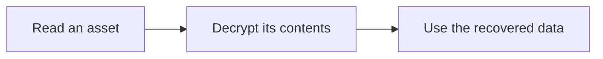

# Personal site

A personal blog built with Next.js and Nextra.

## Write your home page

Edit `pages/index.mdx` to replace the placeholder with your own words.

- Keep `type: page` and `title: Home` in the frontmatter. Update `description` with a short description of your site.
- Replace the main heading, keeping a `<span>` around some of its text. This lets Nextra display your custom heading while keeping the navigation label as “Home.”
- Write the rest of the page in Markdown: paragraphs, lists, and additional headings all work.

For example:

```mdx
---
type: page
title: Home
description: A short description of your site.
---

# Hi, I'm <span>lovyloyv.</span>

Write your introduction here.
```

The GitHub link is configured in `theme.config.js`. You can also update the site name and footer there.

## Write a post

Copy `templates/post.mdx` to `pages/posts/<slug>.mdx`, replacing `<slug>` with a short name such as `my-first-post`. The post will appear in the Posts section, with a URL such as `/posts/my-first-post`.

Edit the title, description, and body. Set `date` to the publication date as a quoted `YYYY-MM-DD` string, and keep `author: lovyloyv`. You can optionally add a frontmatter field such as `tag: notes`.

`pages/posts/index.mdx` is the post listing; keep it in place and create a separate file for each post.

Keep unfinished posts in a `drafts/` folder outside `pages/`, then move them into `pages/posts/` when ready to publish. This version of Nextra does not hide posts marked `draft: true`.

## Diagrams and MDX

Mermaid diagrams use ordinary fenced blocks. The local remark plugin passes their source to a browser-rendered component, so they also work in the GitHub Pages static export.

````md

````

Diagrams follow the light or dark theme and scroll horizontally when wider than the article. JavaScript is required to draw them; the source remains visible while loading or if rendering fails.

Markdown image syntax, such as ``, works in MDX. For comments, use `{/* comment */}` instead of `<!-- comment -->`. Keep code containing literal angle brackets or braces inside fenced code blocks or inline backticks.

## Run locally

From this directory:

```sh
yarn install --frozen-lockfile
yarn dev
```

Open `http://localhost:3000` to preview your changes.

To build and run the production version:

```sh
yarn build
yarn start
```

## GitHub Pages

In `lovyloyv/lovyloyv.github.io`, set **Settings → Pages → Build and deployment → Source** to **GitHub Actions**. Pushing to `main` runs the included build-and-deploy workflow, which uses GitHub's built-in `GITHUB_TOKEN`; do not upload your personal token as a workflow secret.

The public site will be `https://lovyloyv.github.io/`. View deployment progress in the repository's **Actions** tab. The workflow exports static pages, including tags from your posts, with directory-style URLs for GitHub Pages.

GitHub documentation: [Pages publishing source](https://docs.github.com/en/pages/getting-started-with-github-pages/configuring-a-publishing-source-for-your-github-pages-site).
