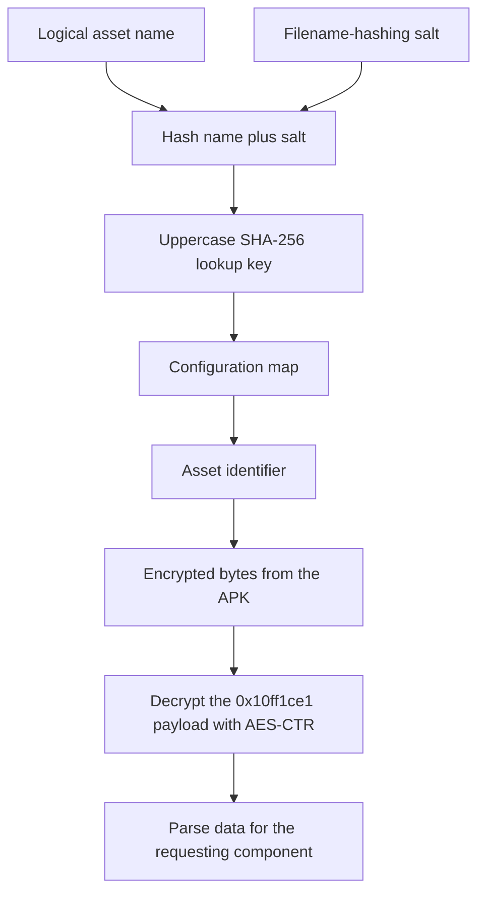
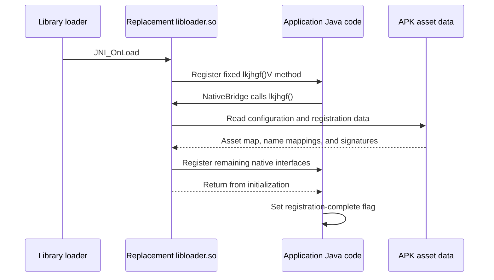
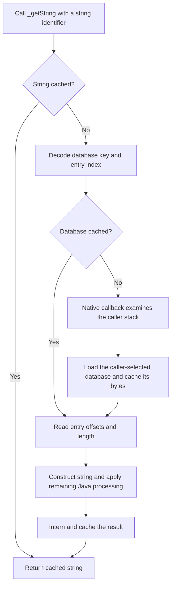
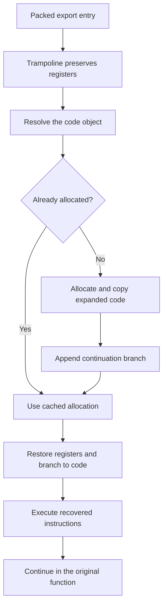
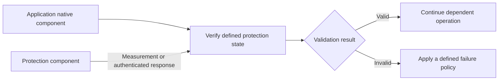

# Emulating Appdome.

An investigation of emulation surrounding Appdome Android.

{/* Local blog source. Code, sample, and image links are pinned to repository revision f04190e2b5bcaa9628a44a681f468c89d8233343. */}

## Index

1. [Introduction](#introduction)
2. [What I wanted to reproduce](#scope)
3. [From strings to the asset system](#assets)
4. [Initialization and native-method mappings](#initialization)
5. [String restoration on demand](#string-restoration)
6. [The first packed-export encounter](#packed-exports)
7. [Reading the code-object format](#object-format)
8. [The semantic-solver detour](#solver)
9. [Reconstructing the runtime path](#runtime)
10. [The replacement implementation](#implementation)
11. [Trying it in other applications](#results)
12. [Proposed mitigations](#mitigations)
13. [Conclusions](#conclusions)
14. [Samples and additional figures](#appendix)

<a id="introduction"></a>

## Introduction

I encountered Appdome while investigating a mobile game's internal systems. My initial goal was to get far enough past the protection to continue that work. The protector became interesting in its own right when I noticed how much it concealed behind opaque assets and data loaded only when needed.

At first, those assets looked like possible bytecode. Following the Java string-restoration path changed that interpretation. The mechanism I examined stored encrypted metadata, configuration, strings, and native code fragments. I did not find a virtual machine behind that asset system. Instead, I found a set of services that connected the application to the protection library.

That connection became the central research question: **how much of the protector's application-facing behavior could a replacement native library reproduce?**

The first experiment restored strings from a saved dump. Later versions loaded the application's own assets, registered the native methods its Java code expected, and resolved packed native exports. The most difficult stage was understanding where the recovered native code was meant to execute. Before I understood the allocation model, I spent approximately a week building a semantic solver to make that code fit back into its original location.

This article follows that progression, from the first string dump to the export resolver, then looks at what could make this approach harder. The code and samples are available in [appdome-emulation](https://github.com/lovyloyv/appdome-emulation). I've included the relevant screenshots and code excerpts along the way.

<a id="scope"></a>

## What I wanted to reproduce

By **emulation**, I mean replacing Appdome's `libloader.so` with my own library and reproducing the parts the application depends on: initialization, native methods, string restoration, and packed exports. I wanted the application to keep working while leaving out the protection behavior that interfered with investigating its internals.

I started around 20 February 2026. After getting string restoration and callbacks working, I paused for about a month, picked it up again around 20 March, and continued through about 24 April. To try the emulator, I replaced the library, rebuilt and re-signed the APK, and ran the application. I did not need root access or further patches to the application.

I'm keeping the applications anonymous. The screenshots and samples come from two applications, mostly the first one where I encountered packed exports, so addresses across separate examples will not always line up. I'll focus on assets, initialization, and code restoration here; detections would be a separate investigation.

<a id="assets"></a>

## From strings to the asset system

My first successful replacement depended on a string dump. I called the original decryption function, saved the results, replaced the native library, and restored the strings myself. The first application ran with that replacement. That was enough to make me look further: if I could understand how Appdome loaded the strings, I could stop depending on a dump made in advance.

The next step was to understand where that data came from. Java string-restoration data lived in `assets/j1O1pP4cpnaLPxs2xoSf/`, a directory name that remained constant in the examined samples. Following the loading and parsing routine opened up the other files in the same directory.

### Looking up a logical asset name

Name lookup and content decryption were separate operations. In the replacement's [asset helpers](https://github.com/lovyloyv/appdome-emulation/blob/f04190e2b5bcaa9628a44a681f468c89d8233343/poc/src/assets/assets.cpp), a logical name is concatenated with a salt, hashed with SHA-256, and converted to uppercase hexadecimal. That value indexes a configuration map, which returns the identifier used to retrieve the asset from the APK.

```text
lookup_key = uppercase_hex(SHA256(asset_name + BLOB_MAGIC))
asset_id   = configuration_map[lookup_key]
contents   = decrypt(asset_directory + asset_id)
```

I refer to the salt as `BLOB_MAGIC`; the source calls the constant `BLOBS_MAGIC`. It is the filename-hashing salt, not an AES key.

The starting point is a configuration file named `uTPEauDexK34zwVRiCRp`. It contains the map I dumped as `hashmap.json`, which associates hashed logical names with asset identifiers or inline configuration values. I load this file by its known identifier first, then use its contents to resolve the other names. In the replacement, `BLOBS_CONFIG_NAME` identifies that file and `populate_hash_map` builds the lookup table.

You can see both kinds of values in the [hash-map sample](https://github.com/lovyloyv/appdome-emulation/blob/f04190e2b5bcaa9628a44a681f468c89d8233343/assets/samples/hashmap.json). I used the [name-hashing helper](https://github.com/lovyloyv/appdome-emulation/blob/f04190e2b5bcaa9628a44a681f468c89d8233343/assets/samples/tester.py) to compare logical names against its keys. This particular map comes from the second application in the collection.



*Figure 1. Asset lookup after the initial configuration map has been loaded.*

### Reading assets from the APK

I found that Appdome loaded these assets by parsing `base.apk` itself. I followed the same approach in the replacement's [APK reader](https://github.com/lovyloyv/appdome-emulation/blob/f04190e2b5bcaa9628a44a681f468c89d8233343/poc/src/assets/apk_assets.cpp). My implementation locates the application's mapped APK, reads its ZIP central directory, and retrieves the requested `assets/` entry, handling both stored and deflated data. The returned bytes then enter the shared blob-decryption routine. This separates reading a file from the APK from resolving its logical name and interpreting its contents.

### The format identifier

Each encrypted asset began with a format identifier. Appdome used that value to select how to decrypt and handle the data. All the samples I collected used `0x10ff1ce1`.

The loader also checked for other identifiers, including `0xB16B00B5`, as shown below. I only had samples of the `0x10ff1ce1` format and didn't investigate what the others were used for.


*Figure 2. Format identifiers recognized by the asset loader. I investigated the `0x10ff1ce1` path.*

That format used AES-CTR, which I recognized from the table initialization. Once I had extracted the AES material and reproduced the routine, I could decrypt the other assets using it too. The same routine was also used for encrypted strings in the native binary, so following the Java string path ended up giving me access to much more than I initially expected. The [native-string dump](https://github.com/lovyloyv/appdome-emulation/blob/f04190e2b5bcaa9628a44a681f468c89d8233343/assets/samples/string_dump.json) contains 1,053 recovered entries.

The [blob archive](https://raw.githubusercontent.com/lovyloyv/appdome-emulation/f04190e2b5bcaa9628a44a681f468c89d8233343/assets/samples/decrypted_blobs_sample.zip) contains the decrypted payloads. Their outer encrypted-asset headers have already been removed, so the files start with the contents discussed in the following sections.

### What the blobs contained

The asset directory combined several kinds of information. I mapped the following names during the investigation. They identify useful parts of the asset system, although the mapping is incomplete.

| Category | Names recovered during the investigation |
| --- | --- |
| String restoration | `StringIndexerInitData`, `JavaStringIndexerDBs`, `JavaStringIndexerPriorityList` |
| Java identity information | `appdome_classes_obf_mapping`, `appdome_method_signature_obf_mapping` |
| Native registration | `native_methods_to_register_arm64-v8a`, `native_methods_to_register_armeabi-v7a`, `native_methods_to_register_x86_64` |
| Packed native code | `shared_objects_code_restore_arm64`, `shared_objects_code_restore_arm32`, `shared_objects_code_restore_x86_64` |
| Other configuration and data | `bootstrap_props`, `BootstrapPropsConfig`, `VirtualMemoryConfig`, `AnalyticsEndpointURL`, `ADFuseDate`, `trustedVendors`, `openssl_error_strings`, `CA-certs` |

I also mapped these names:

```text
anti_emulator_props_check
magisk_hide_props_check
magisk_mtnt_props_check
os_version_check
ANTI_FRIDA
adconfig_devevents
EVENTS_METADATA_IMPL
FAIL_SAFE_ENFORCE
ROOT_CHECK
```

I also found application identity information and certificates. The detection-related names above are part of the asset catalogue; I won't go into their behavior here.

The [extracted-blob archive](https://raw.githubusercontent.com/lovyloyv/appdome-emulation/f04190e2b5bcaa9628a44a681f468c89d8233343/assets/samples/decrypted_blobs_sample.zip) includes the Java mappings, string databases, and `shared_objects_code_restore_arm64`, so you can inspect their contents alongside this section.

Once I could supply these materials from the application itself, the replacement no longer needed to be limited to a saved string dump from one experiment.

<a id="initialization"></a>

## Initialization and native-method mappings

There were two distinct registration stages. The first began at a fixed method that was constant in the builds I investigated:

```smali
.class public Lqwerty/asdfgh/zxcvbn;
.super Ljava/lang/Object;

.method public static native lkjhgf()V
.end method
```

The class is `qwerty/asdfgh/zxcvbn`, and the method is `lkjhgf()V`: static, native, no arguments, and a void return. The recovered `NativeBridge.registerNatives()` invokes it while registration is pending, then sets a completion flag after the call returns.

Both sides are available directly in the [recovered initialization class](https://github.com/lovyloyv/appdome-emulation/blob/f04190e2b5bcaa9628a44a681f468c89d8233343/assets/samples/recovered-classes/qwerty/asdfgh/zxcvbn.smali) and [NativeBridge](https://github.com/lovyloyv/appdome-emulation/blob/f04190e2b5bcaa9628a44a681f468c89d8233343/assets/samples/recovered-classes/runtime/loading/NativeBridge.smali). These files are unchanged extracts from the anonymized class archive.

The replacement registers this known entry point during its own `JNI_OnLoad`. When Java calls it, the handler loads the blobs configuration, builds the asset lookup map, and registers the remaining native interfaces using the retained mappings and registration records.



*Figure 3. Initialization starts with the fixed method, which prepares the mappings needed to register the remaining native interfaces.*

These maps helped twice. First, I wrote a script to recover readable package, class, and member names in the smali, renaming files and references as it went. Then I used the same relationships in the emulator to match my handlers to the JNI names expected by the application.

The [standalone map](https://github.com/lovyloyv/appdome-emulation/blob/f04190e2b5bcaa9628a44a681f468c89d8233343/assets/samples/appdome_classes_obf_mapping.txt) has 59 class records and 232 member pairs that the [recovery script](https://github.com/lovyloyv/appdome-emulation/blob/f04190e2b5bcaa9628a44a681f468c89d8233343/assets/samples/recover_names.py) can interpret. The native-registration tables add class names, method names, signatures, and pointer fields. I've included [two](https://github.com/lovyloyv/appdome-emulation/blob/f04190e2b5bcaa9628a44a681f468c89d8233343/assets/samples/native_methods_to_register_.json) [examples](https://github.com/lovyloyv/appdome-emulation/blob/f04190e2b5bcaa9628a44a681f468c89d8233343/assets/samples/arm64-v8a.json), each with 26 records. I can't place them in a before-and-after sequence, so I use them as separate examples here.

The fixed `lkjhgf()` name did not have to be discovered from those maps. Keeping it separate from the other native identities explains how initialization could begin before the mapping-dependent interfaces were available. The relevant implementation is in [entry.cpp](https://github.com/lovyloyv/appdome-emulation/blob/f04190e2b5bcaa9628a44a681f468c89d8233343/poc/src/entry.cpp) and [natives.cpp](https://github.com/lovyloyv/appdome-emulation/blob/f04190e2b5bcaa9628a44a681f468c89d8233343/poc/src/natives/natives.cpp).

### Supplying data to the existing Java code

The replacement did not need the same amount of behavior behind every callback.

| Interface | Behavior required in the examined paths |
| --- | --- |
| `getStringFromConfig` | Return configuration data requested by Java, including the analytics identifier encountered during the investigation |
| `stringIndexerNativeInitializer` | Supply the initialization material needed to interpret the string database |
| `getStringIndexerDB` | Supply database bytes to the existing Java string indexer |
| `onPausedCalled`, handled by `Java_ON_PAUSE_CB` | No substantive behavior beyond logging was needed in the tested paths |

The configuration delegation is visible in [ADConfig](https://github.com/lovyloyv/appdome-emulation/blob/f04190e2b5bcaa9628a44a681f468c89d8233343/assets/samples/recovered-classes/runtime/ADConfig/ADConfig.smali). String restoration has a more interesting demand-driven path, which explains why supplying the correct database was more useful than restoring all strings at startup.

<a id="string-restoration"></a>

## String restoration on demand

Protected string accesses went through a getter, `_getString(stringId)`. The identifier replaced the plain string at the call site. Appdome used it to check whether the string had already been resolved and, on a cache miss, locate the database and entry needed to construct it.

The important detail was the granularity of loading. This path did not require every protected string database to be loaded at startup. A request selected the database associated with the caller, and Java extracted the requested string from that database. I reproduced the native caller-resolution step in [callbacks.cpp](https://github.com/lovyloyv/appdome-emulation/blob/f04190e2b5bcaa9628a44a681f468c89d8233343/poc/src/natives/callbacks.cpp), while leaving the application's existing Java indexing and caching code in place.

### Two caches, two different responsibilities

The [recovered StringIndexer](https://github.com/lovyloyv/appdome-emulation/blob/f04190e2b5bcaa9628a44a681f468c89d8233343/assets/samples/recovered-classes/runtime/Strings/StringIndexer.smali) separates complete string results from loaded database bytes:

| Cache | Key | Value |
| --- | --- | --- |
| `globalVariableCache` | String identifier passed to `_getString` | Resolved Java string |
| `globalVariableStringDbsPackage` | Encoded database/package identifier extracted from the string identifier | Database byte array |

The public `_getString` delegates to `_internalGetString`. That method first checks the resolved-string cache. A hit returns the existing string. A miss enters `_getStringFromDB`, which separates the identifier's database key from its encoded entry index.

`getStringDbForPackage` then checks the database cache. Only a database-cache miss invokes `NativeBridge.getStringIndexerDB()`. That native method takes no explicit caller or database argument, making the current call stack part of how the required asset is selected.



*Figure 4. String restoration has separate caches for decoded strings and database bytes. Native asset loading occurs only when the required database is absent from the Java cache.*

### Selecting a database from the caller

I reproduced the stack-based selection with `Thread.currentThread().getStackTrace()`. In the current callback, `get_caller_class` reads the class name from stack element 7, then removes the final class component. The asset name therefore uses the caller's **package prefix**, rather than assigning a distinct database to every individual class:

```text
caller_package + "_JavaStringIndexerStringDb_" + application_package
```

The middle component, `_JavaStringIndexerStringDb_`, is a constant defined as `STRING_INDEXER_DB_SUFFIX` in [appdome.hpp](https://github.com/lovyloyv/appdome-emulation/blob/f04190e2b5bcaa9628a44a681f468c89d8233343/poc/src/appdome.hpp). It separates the package names and marks this as a string-database asset. I suspect it also helps avoid naming collisions with other asset categories.

The caller class therefore gives me the package prefix needed to select the asset. Stack element 7 was the caller position in the path I reproduced.

`Java_getStringIndexerDB` passes the resulting name through the same asset lookup and decryption routine described earlier, then returns the bytes as a Java array. The [extracted-blob archive](https://raw.githubusercontent.com/lovyloyv/appdome-emulation/f04190e2b5bcaa9628a44a681f468c89d8233343/assets/samples/decrypted_blobs_sample.zip) has eight of these databases, with different caller prefixes around the same `_JavaStringIndexerStringDb_` constant.

### Finding the requested string inside the database

The initializer supplies constants and a character-to-value map. The method named `base62ToInt` uses that initialized alphabet to decode the entry-index portion of the string identifier. `_getStringFromDB` then reads the database header and index entry to calculate a record offset.

At that record, it reads a length, advances past the four-byte length field, and constructs a UTF-8 string from the corresponding byte slice, using the stored length minus one. `_internalGetString` then calls another Java helper, interns the result, and caches it under the original string identifier. That helper's implementation isn't in the recovered class set, so I can't tell from these files what additional processing it does.

This separates the native AES-CTR asset-decryption stage from Java-side indexing, string construction, and final processing. Supplying the correct database and initializer data allowed my replacement to reuse the existing Java path.

### Why this mattered for dumping

Caller-dependent loading reduced what a single early memory snapshot would expose: a string request brought in the relevant database, rather than causing the getter to restore every database at once. Recovering a broader set through execution would require reaching more caller contexts or independently reconstructing the asset-loading mechanism.

The caches matter here too. Once loaded, databases and resolved strings can remain in memory, so more of them can accumulate as the application runs. The interesting part is that Appdome avoids exposing all of them at once during startup.

<a id="packed-exports"></a>

## The first packed-export encounter

The third game I tried introduced the first packed-export case. An export entry loaded an identifier into `x16` and branched toward a trampoline region in `.bss`. Before initialization, the target region did not contain the code needed to continue.


*Figure 5. A packed export entry.*

A new asset supplied the next lead: `shared_objects_code_restore_arm64`. Its name was visible as plaintext in the protector's native binary. Following its cross-reference directed me into the code-loading logic.


*Figure 6. The exposed asset name that gave the investigation a concrete starting point.*

I was relying primarily on static analysis. I initially expected the routine to be relatively straightforward once string encryption was out of the way, but flattened control flow obscured the relationships among parsing, signal handling, trampolines, and code allocation.


*Figure 7. The control-flow graph I had to work through after finding the asset reference.*

The challenge was to connect the records in the asset to the code that ran, and then determine how that code returned to its original function.

<a id="object-format"></a>

## Reading the code-object format

I initially understood the asset as an original function address, a code size, and code bytes. That interpretation was enough to begin extraction, but it was incomplete. The field descriptions below distinguish that early understanding from what I later implemented.

### The early record sketch

I initially interpreted the tags as follows:

```text
0x59 -> object/code block
    0x39 -> indicator noted beside the code block
    OBJECT_SIZE
    00_PAD[5]
    OBJECT_CODE

0x1C -> another object or record type?  (unresolved in my initial interpretation)
    0x39 -> indicator

0x66 -> original address / associated metadata
    descriptor and shifted value

0x7E -> skip 4  (early interpretation)
```

This was still a rough sketch, particularly the `00_PAD[5]` field and the role of `0x39`. As I worked through more records, the parser needed more precise offset handling and additional metadata alongside the code.

### An address and code example

I extracted the following byte sequence, followed by a recognizable function prologue:

```text
66 38 00 10 AF 07 02 00 00 00 00
59 39 00 CE 00 00 00 00

SUB  SP, SP, #0x90
STP  D9, D8, [SP, #0x30]
STP  X29, X30, [SP, #0x40]
STP  X26, X25, [SP, #0x50]
STP  X24, X23, [SP, #0x60]
STP  X22, X21, [SP, #0x70]
```

The packed address in this example decodes as:

```text
0x0207AF10003866 >> 24 = 0x0207AF10
```

The current parser makes the read position explicit: it consumes the `0x66` tag, reads the next eight bytes as a little-endian value, and shifts that value right by 16. For the shown bytes, this reaches the same address:

```text
after consuming 0x66:
encoded_value = 0x00000207AF100038
flags         = encoded_value & 0xFF = 0x38
decoded_value = encoded_value >> 16  = 0x0207AF10
```

The two shifts therefore refer to different starting representations. Treating the early descriptor sketch as a literal C structure would obscure that distinction.

### What the current parser records

The [code-object parser](https://github.com/lovyloyv/appdome-emulation/blob/f04190e2b5bcaa9628a44a681f468c89d8233343/poc/src/exports/object_data_parser.cpp) recognizes these metadata flags following an address tag:

| Flag | Use in the current implementation |
| --- | --- |
| `0x31` | Original displaced-code size |
| `0x33` | Resolver-pointer relocation location |
| `0x34` | Start of the `.bss` setup region |
| `0x37` | End of the `.bss` setup region |
| `0x38` | Candidate `JNI_OnLoad` address |

For a `0x59` block, my parser treats the payload as starting eight bytes after the tag and checks two possible size-field offsets, `+3` and `+4`. It uses the candidate values and available bytes to choose between them. This handles the layouts I worked with, but I never finished mapping the `0x1C` and `0x7E` records.

Conceptually, an extracted object therefore needs more than just its expanded code length:

```text
code object
    original or relative function address
    stored code length
    original displaced-region length, when available
    offset of the stored code
    recovered code bytes

setup metadata
    .bss region bounds
    resolver-pointer relocation
    initialization-related address information
```

Keeping the original displaced length separate from the stored code length later became important when calculating the continuation address.


*Figure 8. A captured section of the original object parser. Names shown in analysis views may include my annotations.*

I confirmed that the objects contained application code by connecting a known call inside a recovered sequence to the corresponding `JNI_OnLoad` analysis.


*Figure 9. A recognizable call helped connect extracted code to its original function.*

The first parser produced object records; a later version wrote individual objects to files. One mapping run checked 262 entries and matched all 262 names. I've included that output and the earlier parser versions in the [additional figures](#additional-figures).

<a id="solver"></a>

## The semantic-solver detour

Extracting the code introduced a new problem: individual instructions had been expanded into longer sequences. The recovered bytes would not fit into the original function region if I copied them back directly.

I spent approximately a week writing a semantic solver to reduce those expressions. The following example shows a transformation my solver produced.

Before reduction:

```asm
sub sp, sp, #0x28
sub sp, sp, #0x28
stp x29, x30, [sp, #0x20]
str x21, [sp, #0x30]
stp x20, x19, [sp, #0x40]
add x29, sp, #0x10
add x29, x29, #0x10
```

After reduction:

```asm
sub sp, sp, #0x50
stp x29, x30, [sp, #0x20]
str x21, [sp, #0x30]
stp x20, x19, [sp, #0x40]
add x29, sp, #0x20
```

In this example, two stack adjustments become one, and the split calculation of `x29` becomes a single addition. For the cases I worked through, the reduced sequences fit the missing region and could be patched back into the function.


*Figure 10. Another solver run, including reductions from 12 instructions to 4 and from 44 to 14. Some objects stayed unchanged.*

The solver worked for the cases I had tried, but I was spending a lot of time solving a problem I had imposed on myself: making the code fit back where it came from. I went back to the allocation routine to understand how Appdome handled it.

<a id="runtime"></a>

## Reconstructing the runtime path

There were two related problems to understand: getting the protected application's native library through initialization, and resolving ordinary packed exports afterward. The replacement library's own `JNI_OnLoad`, which registers `lkjhgf()V`, should not be confused with the protected application library's packed `JNI_OnLoad` discussed here.

### How the protected JNI_OnLoad entry looked

I identified argument and register saves at the entry, followed by a system-call sequence and a reference into the signal-triggering path. The entry was not a complete, ordinary function body with a small obstacle that could simply be removed.

Selected instructions from the captured entry are reproduced below. The ellipses mark omitted regions, not instructions present in the binary.

```asm
; JNI_OnLoad at 0x0207AF10
STP  X0, X1, [SP, #-0x10]!
STP  X19, X20, [SP, #-0x10]!
MOV  X0, #1
MOV  X1, #1
MOV  X2, #0
MOV  X8, #0xC6
SVC  0
MOV  X19, X0
MOV  X20, SP
SUB  SP, SP, #0x70
...
ADR  X0, loc_207AFCC
MOV  X2, #0x6B
...
BR   X3

loc_207AFCC:
; I identified this region as the faulting path.
EON  X9, X22, X15, ASR #55
DCB  0x80
DCB  0x9E, 0xCB, 0xA0
...

; Body continuation at 0x0207AFE0
BLR  X9
ADRL X8, byte_6AE1B98
LDRB W9, [X8]
```

The continuation starts with `BLR X9`. Its required state was not established by simply skipping the intervening region. This was one reason that removing the apparent fault alone did not reconstruct the missing initialization behavior.

The decompiled stub gave me another view of the same setup. I've kept the names and types from that analysis:

```c
v11 = vm;
v12 = reserved;
v2 = linux_eabi_syscall(__NR_socket, 1, 1, 0);
v10[0].sa_family = 1;
v10[0].sa_data[0] = 0;
v3 = &v10[0].sa_data[1];
v4 = &loc_207AFCC;
v5 = 107;
do {
    v6 = *(_BYTE *)v4;
    if (*(_BYTE *)v4)
        v4 = (int *)((char *)v4 + 1);
    *v3++ = v6;
    --v5;
} while (v5);
*(_DWORD *)&v10[0].sa_data[1] = linux_eabi_syscall(__NR_getpid);
v7 = linux_eabi_syscall(__NR_connect, v2, v10, 0x6Eu);
v8 = linux_eabi_syscall(__NR_read, v2, v10, 8u);
return (*(jint (__fastcall **)(void *, JavaVM *, void *))
        &v10[0].sa_family)(&loc_207AFBC, v11, v12);
```

In the path I investigated, the setup caused a `SIGBUS` that Appdome handled as part of restoration. The analysis led through the signal handler, identification of the relevant native object, restoration of initialization material, and installation of the export resolver.


*Figure 11. The signal handler working with the saved context and locating the native object.*

The replacement's [export setup code](https://github.com/lovyloyv/appdome-emulation/blob/f04190e2b5bcaa9628a44a681f468c89d8233343/poc/src/exports/exports.cpp) reflects those responsibilities: it restores initialization and `.bss` material, installs a resolver pointer, and redirects the saved context. That setup involves patching memory even though the ordinary packed-export path uses separate code allocations.


*Figure 12. Resolver-pointer initialization, one of the connections between setup and the trampoline path.*

### The trampoline

The trampoline preserves registers, passes information about the requested export to the resolver, restores the saved state, and branches to the resolved code. In the captured ARM64 path, `x16` initially supplies the export identity and later carries the resolved allocation address.


*Figure 13. The trampoline's save, resolve, restore, and branch sequence.*

I reproduced the trampoline assembly below with its address columns removed. Labels and the resolver-pointer location belong to this particular excerpt; their addresses need not match the separate screenshot.

```asm
STP  X0, X1, [SP, #-0x10]!
STP  X2, X3, [SP, #-0x10]!
STP  X4, X5, [SP, #-0x10]!
STP  X6, X7, [SP, #-0x10]!
STP  X8, X18, [SP, #-0x10]!
STP  X19, X20, [SP, #-0x10]!
STP  X21, X22, [SP, #-0x10]!
STP  X23, X24, [SP, #-0x10]!
STP  X25, X26, [SP, #-0x10]!
STP  X27, X28, [SP, #-0x10]!
STP  X29, X30, [SP, #-0x10]!
STP  Q0, Q1, [SP, #-0x20]!
STP  Q2, Q3, [SP, #-0x20]!
STP  Q4, Q5, [SP, #-0x20]!
STP  Q8, Q9, [SP, #-0x20]!
STP  Q10, Q11, [SP, #-0x20]!
MOV  X0, X16

loc_EACE8C:
ADR  X1, loc_EACE8C
MOV  X2, X30
ADR  X4, loc_EACE9C
LDUR X4, [X4, #(qword_EACEE8 - 0xEACE9C)]

loc_EACE9C:
BLR  X4
LDP  Q10, Q11, [SP], #0x20
LDP  Q8, Q9, [SP], #0x20
LDP  Q4, Q5, [SP], #0x20
LDP  Q2, Q3, [SP], #0x20
LDP  Q0, Q1, [SP], #0x20
LDP  X29, X30, [SP], #0x10
LDP  X27, X28, [SP], #0x10
LDP  X25, X26, [SP], #0x10
LDP  X23, X24, [SP], #0x10
LDP  X21, X22, [SP], #0x10
LDP  X19, X20, [SP], #0x10
LDP  X8, X18, [SP], #0x10
LDP  X6, X7, [SP], #0x10
LDP  X4, X5, [SP], #0x10
LDP  X2, X3, [SP], #0x10
LDP  X0, X1, [SP], #0x10
BR   X16
```

The final restore sequence leaves `x16` available for the transfer target. The replacement uses `x17` for the continuation address after the recovered instructions have executed.

### Lookup, allocation, and continuation

The resolver associates the export with a code object. If an allocation already exists, it can reuse it. Otherwise, the code is copied into a new allocation with a branch appended to reach the original function's continuation. Expanded instructions can execute at their recovered size because they no longer have to fit into the original gap.



*Figure 14. The reconstructed ordinary ARM64 export path after initialization. Signal-driven setup is separate from this flow.*


*Figure 15. Object lookup in the analyzed resolver path.*


*Figure 16. The allocation routine, including the `mmap` call that made the expanded code's destination clear.*

In the ARM64 replacement, the [resolver](https://github.com/lovyloyv/appdome-emulation/blob/f04190e2b5bcaa9628a44a681f468c89d8233343/poc/src/exports/resolver.cpp) supplies the allocation in `x16` and the continuation in `x17`. The [object manager](https://github.com/lovyloyv/appdome-emulation/blob/f04190e2b5bcaa9628a44a681f468c89d8233343/poc/src/exports/object_manager.cpp) appends `BR X17` to the recovered code and caches the allocation for subsequent calls.

This changed the implementation strategy. I could reproduce the original execution model and keep the expanded code intact. The semantic solver remained an interesting intermediate result, but reducing every sequence was no longer necessary for restoration.


*Figure 17. Resolver logs showing repeated calls to an export reusing the same code allocation.*

<a id="implementation"></a>

## The replacement implementation

The resulting implementation divides the work according to the dependencies uncovered during the investigation.

| Responsibility | Source | Purpose |
| --- | --- | --- |
| Fixed initialization and subsequent native registration | [entry.cpp](https://github.com/lovyloyv/appdome-emulation/blob/f04190e2b5bcaa9628a44a681f468c89d8233343/poc/src/entry.cpp) | Preserve the known Java initialization interface |
| Asset lookup and loading | [assets](https://github.com/lovyloyv/appdome-emulation/blob/f04190e2b5bcaa9628a44a681f468c89d8233343/poc/src/assets/README.md) | Load the bootstrap configuration and resolve named assets |
| Asset decryption | [crypt](https://github.com/lovyloyv/appdome-emulation/blob/f04190e2b5bcaa9628a44a681f468c89d8233343/poc/src/crypt/README.md) | Reproduce the native data-decryption stage |
| Method mapping and registration | [natives.cpp](https://github.com/lovyloyv/appdome-emulation/blob/f04190e2b5bcaa9628a44a681f468c89d8233343/poc/src/natives/natives.cpp) | Connect method roles to each build's JNI identities |
| Configuration and string materials | [callbacks.cpp](https://github.com/lovyloyv/appdome-emulation/blob/f04190e2b5bcaa9628a44a681f468c89d8233343/poc/src/natives/callbacks.cpp) | Keep existing Java-side processing usable |
| Code records, setup, and resolution | [exports](https://github.com/lovyloyv/appdome-emulation/blob/f04190e2b5bcaa9628a44a681f468c89d8233343/poc/src/exports/README.md) | Restore initialization material and execute packed exports through allocations |

At this point, the inputs I needed from the original binary were the salt and AES table material. The emulator handled the asset loading, mappings, and restoration from there. Some callbacks needed real data, especially those used for strings and configuration. Others could stay minimal because the systems they belonged to were absent from my implementation.

Several things made this practical: the fixed initialization method gave me a starting point, the maps let me automate native registration, and the Java string indexer already did most of the string-processing work. For exports, understanding the separate allocations finally removed the need to shrink the code.

<a id="results"></a>

## Trying it in other applications

I tried the emulator in about five applications. For each one, I obtained the salt and AES material, replaced `libloader.so`, rebuilt and re-signed the APK, then ran it while watching my logs and checking that it behaved as expected.

I tested string and export restoration on a Samsung Galaxy A71 running Android 13 and on an ARM64 emulator. In the applications that worked, I saw no crashes, displayed errors, or noticeable lag during those tests. One application did crash. I suspected the cause was outside my emulation, but I still don't know why it failed.

My checks focused on application behavior and the emulator's logs. The code shared with this article comes from that ARM64 investigation.

Most of the material I've included concerns assets and exports, where I spent most of my time: mappings, recovered classes, decrypted blobs, and screenshots of the parser, solver, and resolver. I left out the full semantic solver and AES helper scripts because of their size, but kept the excerpts needed to explain how I used them.

<a id="mitigations"></a>

## Proposed mitigations

The first thing I would change is the exposed name mappings. They made both the investigation and the emulator's automation much easier. After that, I would look at checks in the application itself. I haven't tested either defense; these are the changes I would try based on what the emulator relies on.

### Remove unnecessary name mappings

The class and member maps gave me readable names, clear places to start reversing, and the information needed to register my own callbacks. Removing them would break the emulator's current mapping process and force me to recover those relationships another way.

The protector still needs a working initialization process. Deleting a required file without changing that process would break the protected application too. A replacement design would need to revise how native identities are represented and registered while retaining only the information required at runtime.

A binary representation that omits readable names is one possibility. Its value depends on how much information it removes and how much work recovery requires. Converting the same readily recoverable name relationships from text to binary would provide a much smaller change than eliminating those relationships from the distributed metadata.

The fixed `lkjhgf()` method is a separate issue. Changing that name alone would leave the downstream mapping information exposed. Conversely, removing the mappings could disrupt the current automation even if the initialization method remained recognizable.

I would expect the main work to be redesigning registration. Removing the readable maps themselves should add little runtime cost, though that would need testing with the new registration scheme.

### Add verification in the application

My preferred place for an additional check would be the application's own native library. Candidate mechanisms include measuring the expected `libloader.so` or exchanging authenticated messages with the protection component.



*Figure 18. The application checking the protection library before continuing an operation.*

Hashing `libloader.so` would check its file contents. A handshake could also require a response from the protection library while the application is running, although it would need to reject replayed responses. Either way, a failed check would need to affect execution, for example by reporting the mismatch and stopping the affected path.

I wouldn't consider the check fully trustworthy. Someone who can rebuild the APK can also look for the verifier, patch it, or reproduce what it expects. It would give me another problem to solve before the replacement could work.

Integration is the difficult part for a protector used across many applications. Appdome would need to insert the check or provide code for the developer to integrate. For repeated checks, I'd start with the application's main native library where one exists, since it is already needed while the application runs. Startup, updates, and normal lifecycle changes would all need to keep working.

### How I would test those changes

I would try adapting the current emulator twice: first to work without the name maps, then to reproduce the application/protector handshake. My criterion would be that the defenses stop both attempts. Simply making me spend more time would not meet it if I still got the emulator working.

Those attempts would need a set time budget and agreed limits on what could be changed. I would also check that the protected application still worked normally and measure any added startup or runtime cost.

<a id="conclusions"></a>

## Conclusions

I started this just wanting to get past Appdome and look into a game's internals. Following its string restoration led much further: the same asset system held the maps, configuration, and packed code that connected it to the application. Once I understood those connections, I could reproduce the parts the application needed in my own library.

The exports were the most interesting part for me. I spent a week trying to make expanded instructions fit back into their original functions, only to find that Appdome kept them in separate allocations and branched back afterward. The solver was useful work, but understanding that execution path made the replacement much simpler.

What stood out was how these pieces worked together: on-demand data loading, Java-side string handling, packed exports, trampolines, and a resolver that only allocated code when it was needed. The exposed mappings and shared decryption routine gave me a way into that system. Removing those maps would be the first change I would make to complicate the same approach.

<a id="appendix"></a>

## Samples and additional figures

The companion repository, [lovyloyv/appdome-emulation](https://github.com/lovyloyv/appdome-emulation), contains [the code](https://github.com/lovyloyv/appdome-emulation/blob/f04190e2b5bcaa9628a44a681f468c89d8233343/poc/README.md), [images](https://github.com/lovyloyv/appdome-emulation/blob/f04190e2b5bcaa9628a44a681f468c89d8233343/assets/images/README.md), and the [anonymized samples](https://github.com/lovyloyv/appdome-emulation/blob/f04190e2b5bcaa9628a44a681f468c89d8233343/assets/samples/README.md). The links here point to the version used for this article.

### Files to follow along with

| Part of the investigation | Files |
| --- | --- |
| The initial configuration contains hashed-name mappings and configuration values | [hashmap.json](https://github.com/lovyloyv/appdome-emulation/blob/f04190e2b5bcaa9628a44a681f468c89d8233343/assets/samples/hashmap.json), with the [comparison helper](https://github.com/lovyloyv/appdome-emulation/blob/f04190e2b5bcaa9628a44a681f468c89d8233343/assets/samples/tester.py) |
| Original and obfuscated Java identities were retained | [Class/member map](https://github.com/lovyloyv/appdome-emulation/blob/f04190e2b5bcaa9628a44a681f468c89d8233343/assets/samples/appdome_classes_obf_mapping.txt) and [name-recovery script](https://github.com/lovyloyv/appdome-emulation/blob/f04190e2b5bcaa9628a44a681f468c89d8233343/assets/samples/recover_names.py) |
| Initialization begins at the fixed `lkjhgf()V` method | [Initialization class](https://github.com/lovyloyv/appdome-emulation/blob/f04190e2b5bcaa9628a44a681f468c89d8233343/assets/samples/recovered-classes/qwerty/asdfgh/zxcvbn.smali) and [NativeBridge](https://github.com/lovyloyv/appdome-emulation/blob/f04190e2b5bcaa9628a44a681f468c89d8233343/assets/samples/recovered-classes/runtime/loading/NativeBridge.smali) |
| Native identities include signatures as well as names | [Registration table](https://github.com/lovyloyv/appdome-emulation/blob/f04190e2b5bcaa9628a44a681f468c89d8233343/assets/samples/native_methods_to_register_.json) and [second ARM64 table](https://github.com/lovyloyv/appdome-emulation/blob/f04190e2b5bcaa9628a44a681f468c89d8233343/assets/samples/arm64-v8a.json) |
| String restoration uses two caches and an indexed database | [StringIndexer](https://github.com/lovyloyv/appdome-emulation/blob/f04190e2b5bcaa9628a44a681f468c89d8233343/assets/samples/recovered-classes/runtime/Strings/StringIndexer.smali), with caller selection in [callbacks.cpp](https://github.com/lovyloyv/appdome-emulation/blob/f04190e2b5bcaa9628a44a681f468c89d8233343/poc/src/natives/callbacks.cpp) |
| The asset collection includes separate string databases and packed native code | [Extracted-blob archive](https://raw.githubusercontent.com/lovyloyv/appdome-emulation/f04190e2b5bcaa9628a44a681f468c89d8233343/assets/samples/decrypted_blobs_sample.zip) |
| Native-string recovery produced a concrete dataset | [String dump](https://github.com/lovyloyv/appdome-emulation/blob/f04190e2b5bcaa9628a44a681f468c89d8233343/assets/samples/string_dump.json) |
| The readable classes form a larger recovered set | [Complete class archive](https://raw.githubusercontent.com/lovyloyv/appdome-emulation/f04190e2b5bcaa9628a44a681f468c89d8233343/assets/samples/classes.zip) |

I removed identifying names from the samples and masked them in the screenshots. The files come from two applications and should be read as separate examples. Renamed assets may no longer match their original hashes, so these copies are for following the analysis, not for feeding back into the emulator.

<a id="additional-figures"></a>

### Parser development and mapping

<details>
<summary>Initial parser output and the later object-dumping pass</summary>


*Figure A1. Output from the first parser.*


*Figure A2. A later pass that wrote recovered objects to files for inspection.*

</details>

<details>
<summary>Address mapping and the captured match count</summary>


*Figure A3. A mapping check for one captured run. The application-specific symbol column is masked.*

</details>

### Resolver development and shared helpers

<details>
<summary>The early trampoline and resolver attempt</summary>


*Figure A4. An intermediate implementation capture, before the final execution model was fully understood.*

</details>

<details>
<summary>ELF lookup and its shared references</summary>


*Figure A5. Shared references that helped connect the analyzed paths.*


*Figure A6. The ELF lookup call.*

</details>

### An alternative view of the code

<details>
<summary>An alternative view of the recovered code</summary>


*Figure A7. A second analysis view of the region used to connect recovered code to its original role.*

</details>
\
\- Lovy.